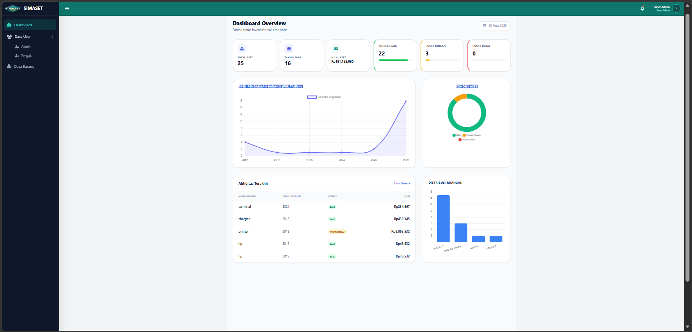
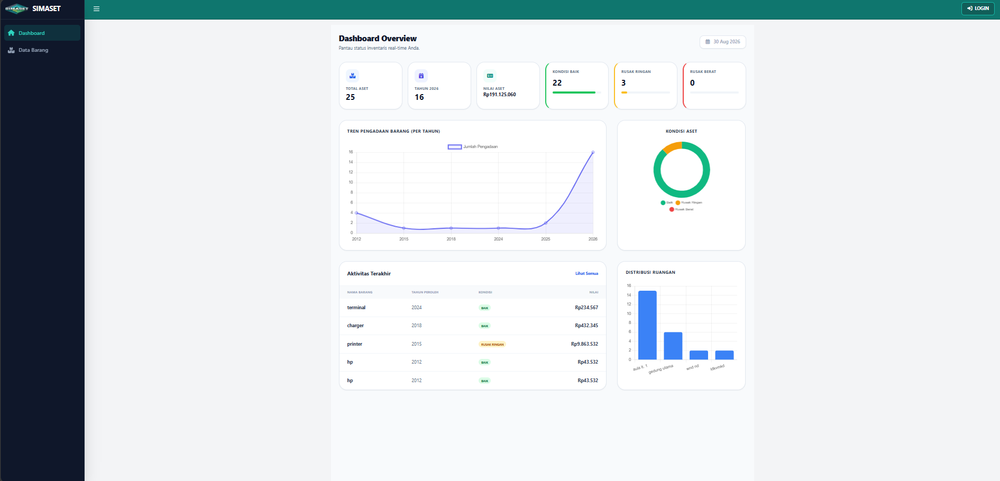
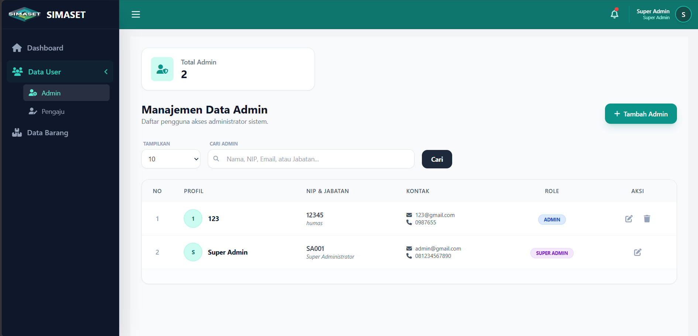
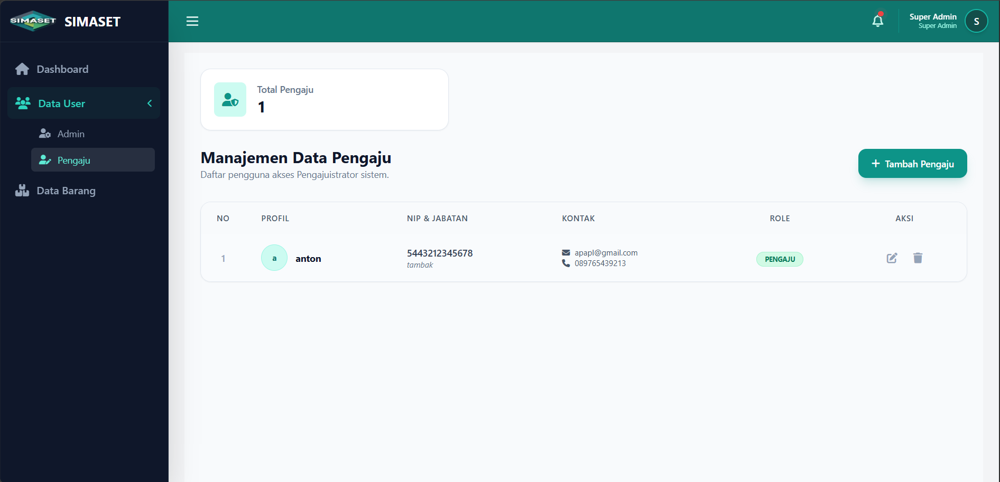
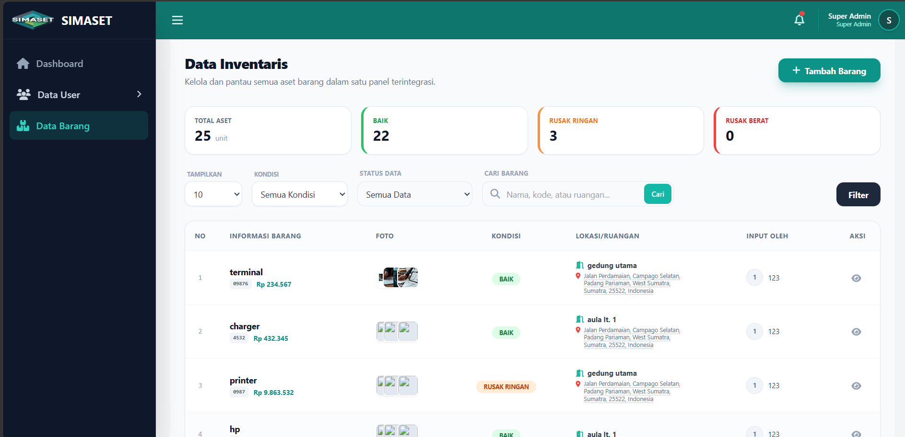
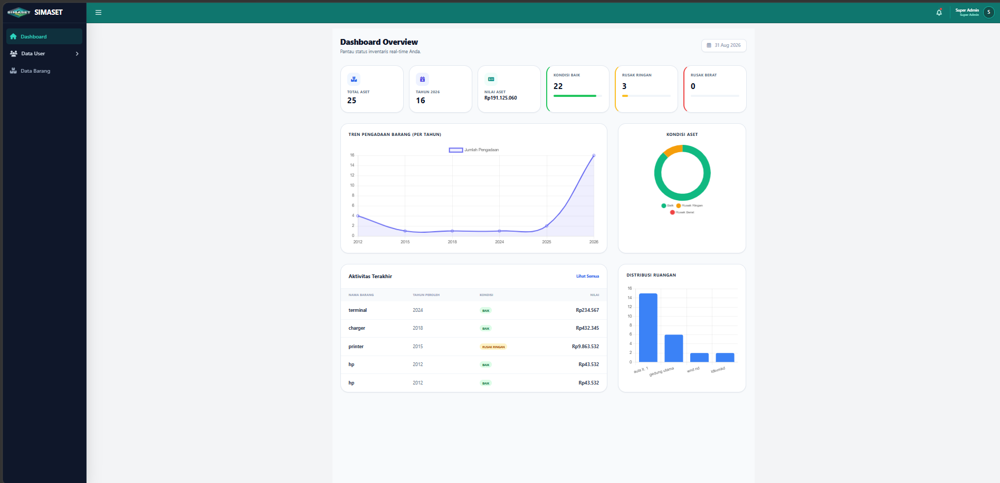
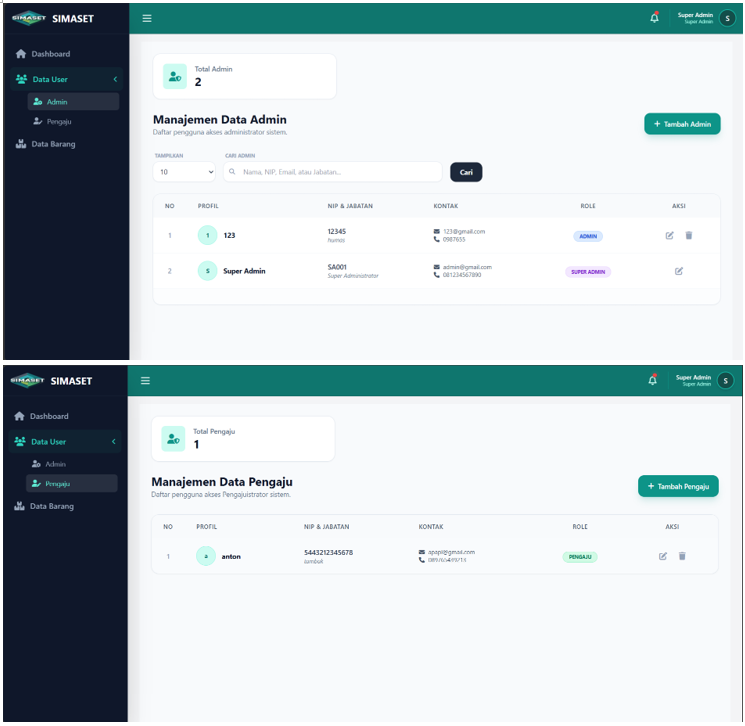
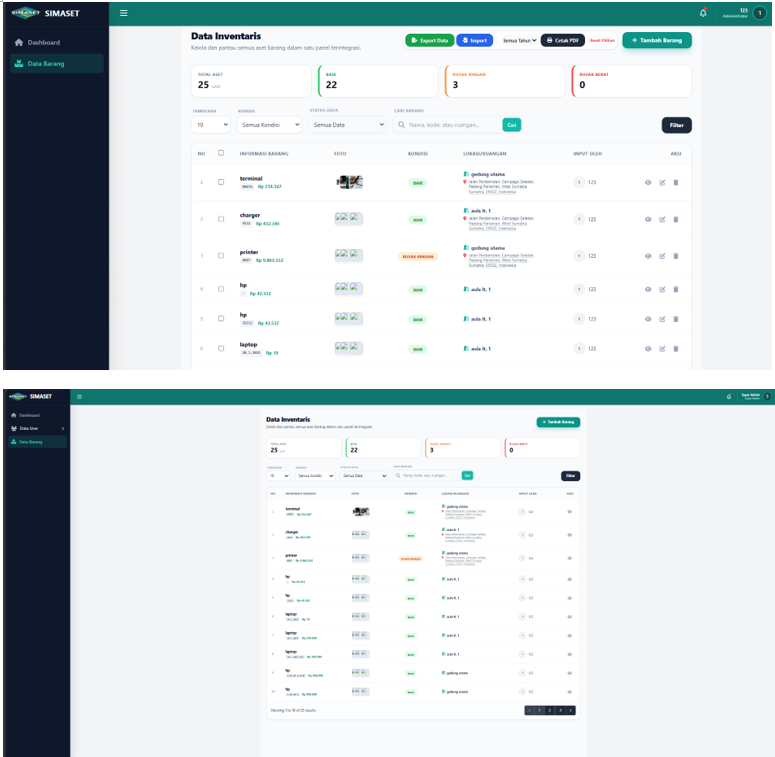

# SIMASET

## Sistem Informasi Manajemen Aset

SIMASET adalah aplikasi berbasis web yang digunakan untuk membantu pengelolaan dan pencatatan data aset. 
Sistem ini dirancang untuk mempermudah proses pendataan aset, pengelolaan pengguna, serta pengajuan aset dari setiap unit atau ruangan.

Aplikasi ini memiliki sistem hak akses berdasarkan peran pengguna, yaitu Super Admin, Admin, dan Pengaju.

---

## 📋 Latar Belakang

Pengelolaan aset yang masih dilakukan secara manual dapat menyebabkan beberapa permasalahan, seperti kesalahan pencatatan, kesulitan dalam mencari informasi aset, serta kurangnya monitoring terhadap kondisi dan lokasi aset.

SIMASET dibuat sebagai solusi untuk membantu proses pengelolaan aset secara digital dalam satu sistem terintegrasi.

---

## ✨ Fitur Utama

Beberapa fitur utama dalam aplikasi SIMASET:

- Dashboard monitoring aset
- Manajemen data barang/aset
- Manajemen pengguna
- Manajemen data Admin
- Manajemen data Pengaju
- Sistem hak akses berdasarkan role pengguna
- Pencarian data barang
- Filter data barang
- Monitoring kondisi aset
- Monitoring lokasi atau ruangan aset
- Tambah data barang
- Edit data barang sesuai hak akses
- Hapus data barang sesuai hak akses
- Upload foto aset
- Export data
- Import data
- Cetak data aset

---

# 👥 Role Pengguna

SIMASET memiliki tiga jenis pengguna:

## 1. Super Admin

Super Admin memiliki akses tertinggi dalam sistem.

Tugas utama Super Admin adalah:

- Mengelola data pengguna
- Menambahkan akun Admin
- Menambahkan akun Pengaju
- Melihat data aset
- Memantau kondisi aset
- Memantau aktivitas data aset
- Menambahkan data barang apabila diperlukan

Menu khusus yang dimiliki oleh Super Admin adalah:

- Dashboard
- Data User
  - Admin
  - Pengaju
- Data Barang

Fitur **Data User hanya tersedia untuk Super Admin**.

---

## 2. Admin

Admin bertugas untuk melakukan pengelolaan data aset.

Admin dapat:

- Melihat dashboard
- Melihat data barang
- Menambahkan data barang
- Mengedit data barang
- Menghapus data barang
- Melihat kondisi dan lokasi aset

Admin tidak memiliki akses untuk mengelola Data User.

---

## 3. Pengaju

Pengaju merupakan pengguna yang berasal dari perwakilan ruangan atau penanggung jawab unit.

Pengaju bertugas untuk mengajukan atau menambahkan data aset baru yang belum tercatat dalam sistem.

Pengaju dapat:

- Melihat data barang
- Menambahkan atau mengajukan data barang

Pengaju tidak dapat:

- Mengedit data barang
- Menghapus data barang
- Mengelola data pengguna

---

# 🔐 Hak Akses Pengguna

| Fitur                 | Super Admin | Admin | Pengaju |
|-----------------------|---------------------|---------|
| Melihat Dashboard     | ✅            | ✅ | ✅ |
| Melihat Data Barang   | ✅            | ✅ | ✅ |
| Melihat Detail Barang | ✅            | ✅ | ✅ |
| Menambah Data Barang  | ✅            | ✅ | ✅ |
| Mengedit Data Barang  | ❌            | ✅ | ❌ |
| Menghapus Data Barang | ❌            | ✅ | ❌ |
| Mengelola Data User   | ✅            | ❌ | ❌ |
---

# 📊 Dashboard

Dashboard digunakan untuk menampilkan ringkasan informasi aset secara real-time.

Informasi yang ditampilkan meliputi:

- Total aset
- Jumlah aset dalam kondisi baik
- Jumlah aset rusak ringan
- Jumlah aset rusak berat
- Tren pengadaan barang
- Kondisi aset
- Distribusi ruangan
- Aktivitas terakhir

### Tampilan Dashboard



---

# 👤 Manajemen Data User

Fitur Data User hanya dapat diakses oleh **Super Admin**.

Data pengguna terdiri dari:

- Admin
- Pengaju

### Data Admin

Admin merupakan pengguna yang bertugas mengelola data aset dalam sistem.



### Data Pengaju

Pengaju merupakan perwakilan ruangan atau penanggung jawab unit yang bertugas mengajukan atau menambahkan data aset yang belum tercatat.



---

# 📦 Data Barang

Fitur Data Barang digunakan untuk mengelola seluruh data aset yang tercatat dalam sistem.

Informasi yang tersedia meliputi:

- Nama barang
- Kode barang
- Foto barang
- Nilai barang
- Kondisi barang
- Lokasi atau ruangan
- Pengguna yang melakukan input

### Tampilan Data Barang - Super Admin



### Tampilan Data Barang - Admin

Admin memiliki akses untuk:

- Melihat data
- Menambahkan data
- Mengedit data
- Menghapus data


### Tampilan Data Barang - Pengaju

Pengaju hanya dapat menambahkan atau mengajukan data barang dan tidak memiliki akses untuk mengedit atau menghapus data.

---

# 🖥️ Tampilan Aplikasi

## Halaman Dashboard



## Manajemen Data User



## Data Barang



---

# 🛠️ Teknologi yang Digunakan

Aplikasi SIMASET dibangun menggunakan teknologi:

- Laravel
- PHP
- MySQL
- JavaScript
- Blade
- Tailwind CSS
- Vite

---


# ⚙️ Instalasi dan Menjalankan Project

## 📋 Prasyarat

Pastikan perangkat telah menginstal:

- PHP
- Composer
- MySQL
- Node.js dan npm

## 1. Clone Repository

```bash
git clone https://github.com/dwitiara22/SIMASET.git
```

## 2. Masuk ke Folder Project

```bash
cd SIMASET
```

## 3. Install Dependency PHP

```bash
composer install
```

## 4. Install Dependency JavaScript

```bash
npm install
```

## 5. Buat File Environment

### Windows (PowerShell)

```powershell
Copy-Item .env.example .env
```

### Linux / macOS

```bash
cp .env.example .env
```

## 6. Generate Application Key

```bash
php artisan key:generate
```

## 7. Konfigurasi Database

Buat database baru dengan nama:

```text
simaset
```

Kemudian sesuaikan konfigurasi database pada file `.env`:

```env
DB_CONNECTION=mysql
DB_HOST=127.0.0.1
DB_PORT=3306
DB_DATABASE=simaset
DB_USERNAME=root
DB_PASSWORD=
```

> Sesuaikan konfigurasi database dengan MySQL pada perangkat Anda.

## 8. Jalankan Migration

```bash
php artisan migrate
```

## 9. Buat Storage Link

Jika aplikasi menggunakan upload foto barang, jalankan:

```bash
php artisan storage:link
```

## 10. Jalankan Laravel Server

```bash
php artisan serve
```

Aplikasi dapat diakses melalui:

```text
http://127.0.0.1:8000
```

## 11. Jalankan Vite

Buka terminal baru pada folder project, kemudian jalankan:

```bash
npm run dev
```

---

# 🚀 Menjalankan Aplikasi

Pastikan kedua proses berikut berjalan:

### Terminal 1 — Laravel

```bash
php artisan serve
```

### Terminal 2 — Vite

```bash
npm run dev
```

Kemudian buka:

```text
http://127.0.0.1:8000
```

---

# 👩‍💻 Developer

- **Dwi Tiara Puspa**
- **Muhammad Fajrin Lubis**